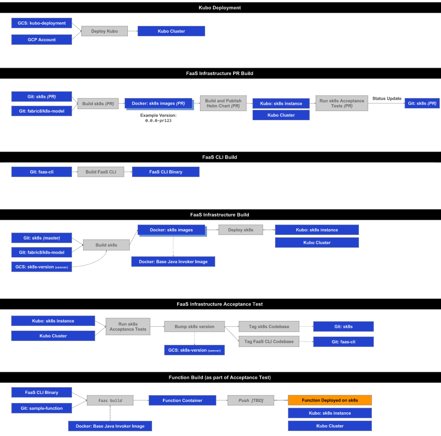

# PFS CI

For concourse bosh access

```
eval "$(./concourse/bbl/print_bbl_env.sh)"
```
### Versioning
Container images and Helm charts built from `sk8s` are versioned using the Concourse `semver` resource. By default, a `SNAPSHOT` suffix is added to the version number. 
- To bump the patch version, run the `version-bump-patch` job
- To generate a final version number (without a suffix), run the `version-bump-final` job

### Helm Charts
Charts (and a corresponding `index.yaml` for the latest build) are published to https://storage.googleapis.com/sk8s_charts_dev

### Concourse: https://ci.faas.to.cf-app.com

### CI Flow


